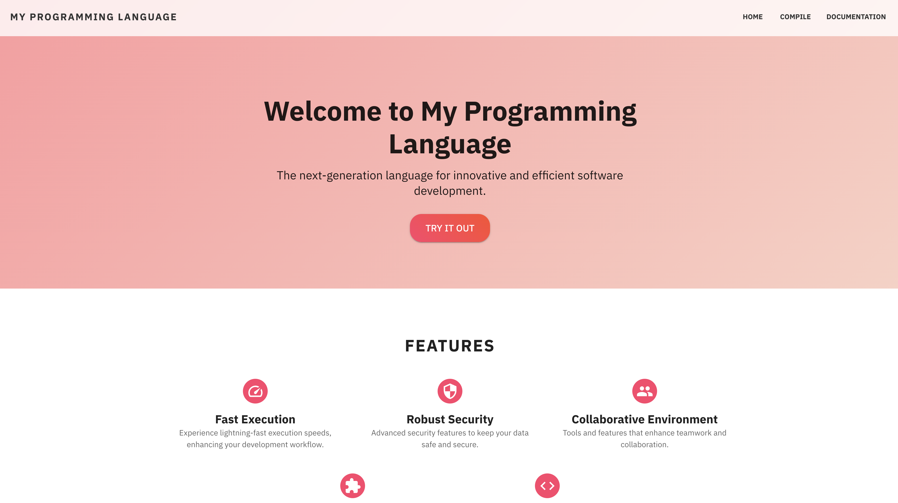
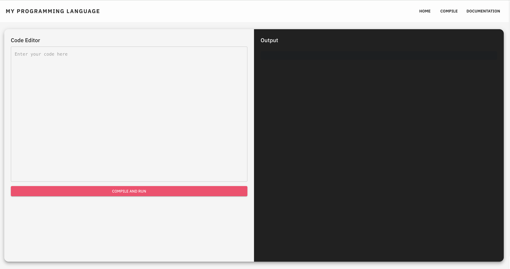
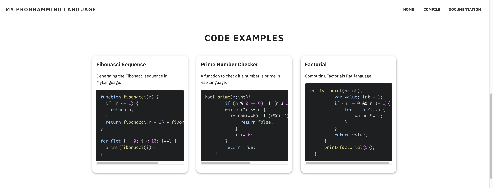
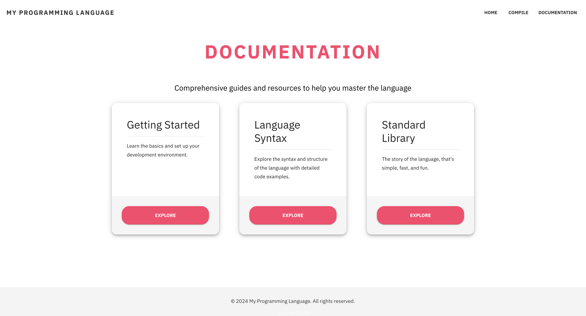

# Programming Languages Showcase Template

This project provides a comprehensive template for showcasing various programming languages. It features a three-page layout: a home page, a virtual IDE for the live coding, and a documentation/getting started guide. Ideal for developers looking to explore or demonstrate different programming technologies.


## Features

- **Home Page:** Introduces the purpose of the website and highlights featured programming languages.
- **Virtual IDE:** A browser-based IDE where users can write, edit, and run code in various programming languages.
- **Documentation/Getting Started:** Provides essential information on how to use the platform, including code examples and tutorials.

## Live Demo

Check out the live example here: [PLangTemplate Live Demo](https://main.dq6ubbz1oqd87.amplifyapp.com)

## Screenshots

### Home Page
Showcases the introductory page of the website, highlighting featured programming languages.



### Compilation Page
Displays the page where users can write, edit, and run code.



### Example Section
Shows the example section within the documentation or IDE page.



### Documentation Page
Provides a glimpse of the documentation section, including code examples and tutorials.




## Prerequisites

Before you begin, ensure you have installed [Node.js](https://nodejs.org/) on your system which includes npm (Node Package Manager).

## Installation

To set up the template on your local machine:

1. Clone the repository:
   ```bash
   git clone https://your-repository-url-here.git
   ```
2. Navigate to the project directory:
   ```bash
   cd your-project-directory
   ```
3. Install dependencies:
   ```bash
   npm install
   ```

## Running the Application

To run the application locally:

```bash
npm start
```

This will start the server and the website will be accessible at `http://localhost:3000`. Make adjustments to the port settings in your environment if necessary.

## Contributing

Contributions to this template are welcome. Feel free to fork the repository and submit pull requests. You can also open issues to discuss improvements or report bugs.


Add more examples in different programming languages as needed to enhance the learning experience for users.

## License

This project is licensed under the MIT License - see the [LICENSE.md](LICENSE) file for details.
